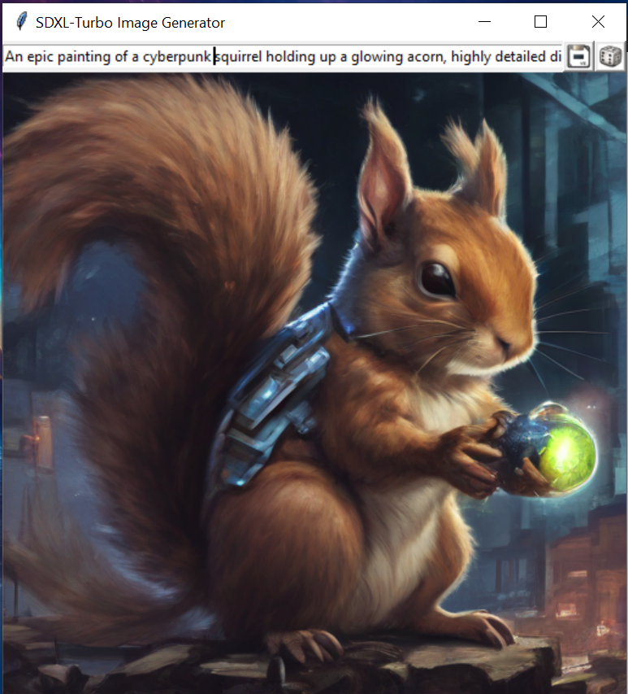

# SDXL-Turbo Image Generator

## Install dependencies

Install PyTorch:

```shell
pip install torch torchvision torchaudio --index-url https://download.pytorch.org/whl/cu121
```

Install other dependencies:

```shell
pip install -r requirements.txt
```

## Launch:

```shell
python main.py
```

## Generate Images:

Simply start typing into the prompt to generate an image. The UI will start with a random seed, but
will reuse the seed with each prompt. Using the same prompt again will generate an identical image.

Click on the save icon to save your image, click on the dice icon to use a new random seed (this
will also generate a new image).


